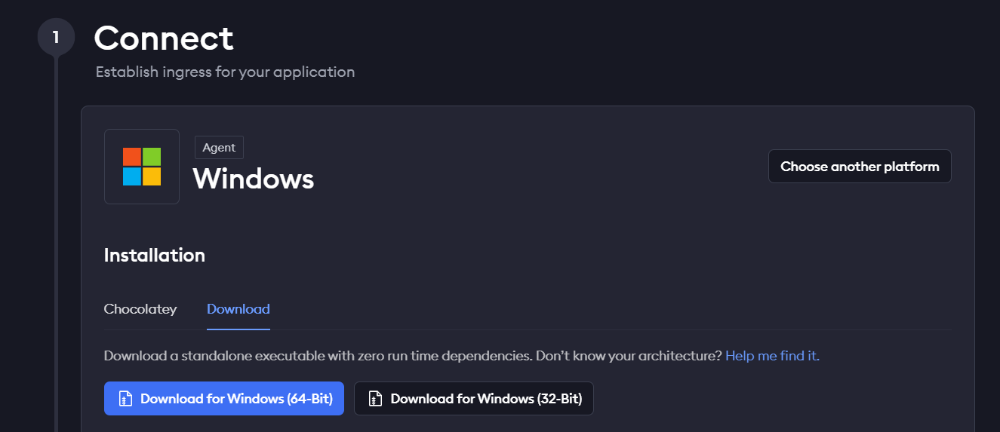

# Requirements
- Install Docker via link (https://docs.docker.com/desktop/install/windows-install/);

### If you use TGBot to run website
- install Ngrok (https://dashboard.ngrok.com/get-started/setup/windows)
 


# How to run the project
Firstly create ```.env``` file in project root folder with following parameters:
```
DEBUG=1
DJANGO_ALLOWED_HOSTS=*

DB_NAME=bwgcombat_db
DB_HOST=db
DB_USER=root
DB_PASS=root
DB_PORT=5432

NGROK_AUTHTOKEN=__token__
NGROK_PORT=8000

JWT_SIGNING_KEY=some_key
```
You can get NGROK_AUTHTOKEN via link (https://dashboard.ngrok.com)

Then run following commands to configure Docker and install all requirements:
```
docker-compose build
```

To **start the app** use command:
```
docker-compose up
```
To **stop the app** press ```CTRL-C```
To delete all containers use command:
```
docker-compose down
```

Useful commands:
- to **execute command** with new app creation or applying migration use syntax (and **put your command into ""**):
```
docker-compose run --rm app sh -c ""
```

## Get access to backend from dedicated PC

- visit http://localhost:4040
- send link to friend for further collaboration;  
