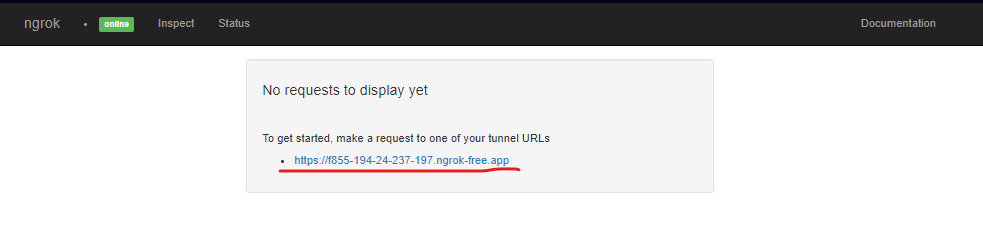
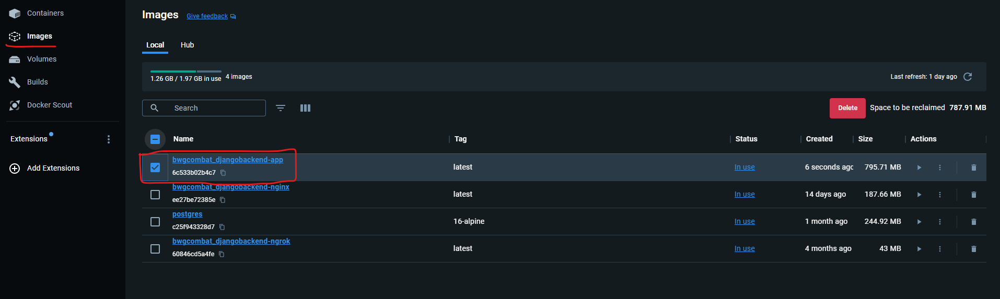

# Requirements
- Install Docker via link (https://docs.docker.com/desktop/install/windows-install/);

### If you use TGBot to run website
- install Ngrok (https://dashboard.ngrok.com/get-started/setup/windows)
 


# How to run the project
Firstly create ```.env``` file in project root folder with following parameters:
```
DEBUG=1
DJANGO_ALLOWED_HOSTS=*

ADMIN_USERNAME=admin
ADMIN_PASSWORD=admin
ADMIN_TG_ID=987654321

DB_NAME=bwgcombat_db
DB_HOST=db
DB_USER=root
DB_PASS=root
DB_PORT=5432

NGROK_AUTHTOKEN=__token__
NGROK_PORT=8000

JWT_SIGNING_KEY=some_key
```
You can get NGROK_AUTHTOKEN via link (https://dashboard.ngrok.com)

Then run following commands to configure Docker and install all requirements:
```
docker-compose build
```

To **start the app** use command:
```
docker-compose up
```
To **stop the app** press ```CTRL-C```
To delete all containers use command:
```
docker-compose down
```

## Useful commands
- to **execute command** with new app creation or applying migration use syntax (and **put your command into ""**):
  ```
  docker-compose run --rm app sh -c ""
  ```
- Run following command to migrate models to db
  ```
  docker-compose run --rm app sh -c "python3 manage.py migrate"
  ```
- This command to seed data into database
  ```
  docker-compose run --rm app sh -c "python3 manage.py seed_db"
  ```

## Get access to backend from dedicated PC
- visit http://localhost:4040
- send link to friend for further collaboration;  



## Send to cloud
- build your project image ```docker-compose build```;
- check built_image_name (in my case ```bwgcombat_djangobackend-app```)

- tag ***built_image_name*** with ***repository_name*** and ***repository_tag*** using command:
  ```
  docker tag <built_image_name> <repository_name>:<repository_tag>
  ```
  where\
  ```repository_name=alexk0valchuk/bwgcombat```
  ```repository_tag=backend```\
  and in my case\
  ```built_image_name=bwgcombat_djangobackend-app```\
  \
  so final command:
  ```
  docker tag bwgcombat_djangobackend-app alexk0valchuk/bwgcombat:backend
  ```
- push ***built_image*** to ***repository*** with command:
  ```
  docker push alexk0valchuk/bwgcombat:backend
  ```
- run special docker-compose.yml file located on github_repo()